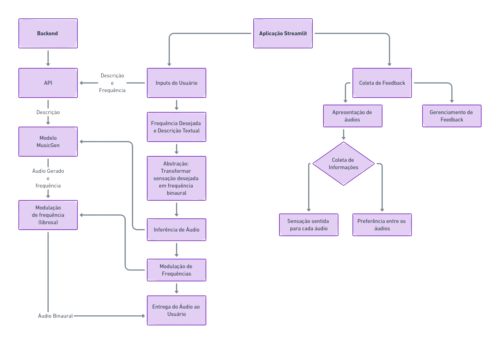
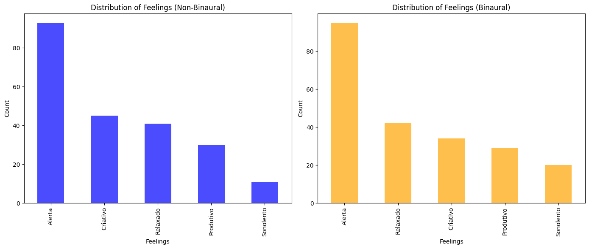
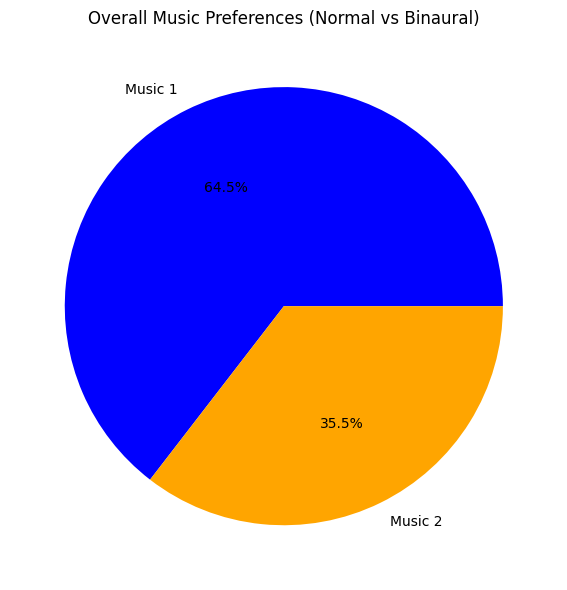
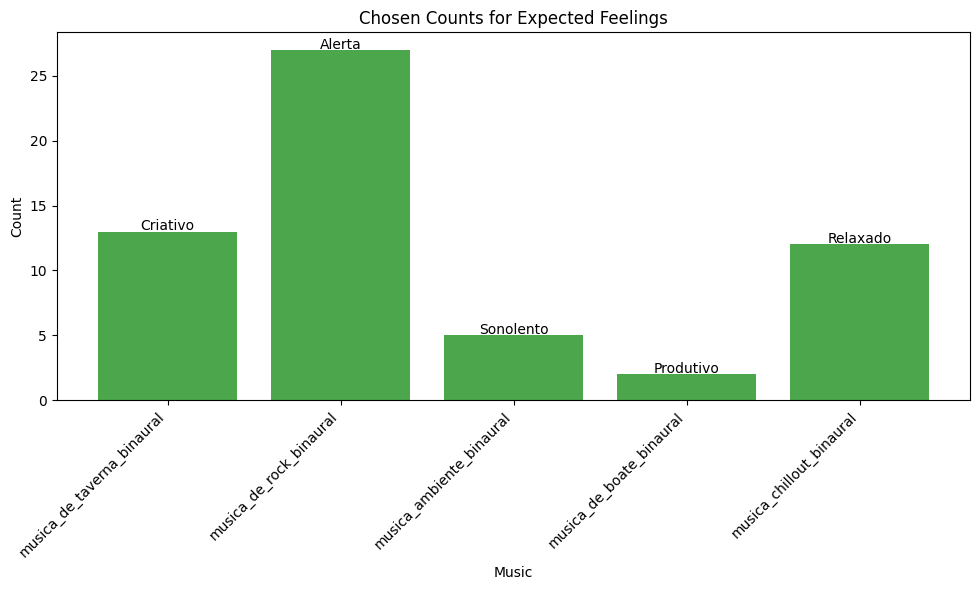

[](https://classroom.github.com/a/H1QdPKuv)
[](https://classroom.github.com/online_ide?assignment_repo_id=16992133&assignment_repo_type=AssignmentRepo)
# INF0413 - Processamento Digital de Sinais e Imagens

Equipe: \
202303342 - HERIK KAUAN DE ASSIS \
202303352 - LUIS EDUARDO FONSECA ALVES FERREIRA MATHIAS CRUVINEL \
202303355 - MATEUS LACERDA ALVES SILVA \
202305745 - NICKOLAS IORY BERNARDES SILVA \
202303359 - PEDRO REIS PIMENTA 

# Conteúdos
1. [Artigo](#nome_artigo)
    1. [Resumo](#resumo)
    2. [Palavras-chave](#palavras_chave)
    3. [Introdução](#introducao)
    4. [Fundamentação teórica](#fund_teorica)
    5. [Metodologia](#metodologia)
    6. [Resultados e conclusões](#resultados)
    7. [Referências](#referencias)
    8. [Apêndices](#apendices)
2. [Ambiente de desenvolvimento](#ambiente)
3. [Utilização](#utilizacao)


# Geração de Músicas Binaurais <a name="nome_artigo"></a>
## Uma aplicação de IA generativa com técnicas de modularização de áudio

### Resumo <a name="resumo"></a>
Do processo de ideação, tem-se como fator motivador a capacidade cognitiva presente nos áudios com frequências binaurais. Para este projeto, utiliza-se o **AudioCraft** da **Meta** para gerar músicas a partir de descrições textuais com o modelo **MusicGen**. Em seguida, aplica-se um processo de modulação de frequência para criar batimentos binaurais para cada ouvido. O processo envolve gerar ondas senoidais com frequências diferentes, combiná-las com a música gerada e ajustar o volume para preservar a qualidade sonora. A tecnologia utilizada foi a linguagem de programação `Python`, com as bibliotecas `librosa`, `pydub` e `audiocraft`.

### Palavras-chave <a name="palavras_chave"></a>
[Inteligência Artificial Generativa](https://en.wikipedia.org/wiki/Generative_artificial_intelligence), [Binaural](https://en.wikipedia.org/wiki/Binaural_beats), [AudioCraft](https://github.com/facebookresearch/audiocraft), [Transposição de Pitch](https://en.wikipedia.org/wiki/Pitch_shift), [Modulação de Frequência](https://en.wikipedia.org/wiki/Frequency_modulation)

### Introdução <a name="introducao"></a>

A música tem um impacto significativo na cognição humana, influenciando estados emocionais, níveis de concentração e processos terapêuticos. Neste contexto, as frequências binaurais são uma ferramenta promissora, que, ao serem sincronizadas com as ondas cerebrais fundamentais, promovem benefícios como relaxamento, aumento de atenção e alívio de estresse (Gao & Hsu, 2020; Lane et al., 1998). 

No entanto, a criação personalizada de músicas que as incorporam de maneira eficiente ainda apresenta desafios, especialmente no que tange à integração harmoniosa entre elementos musicais e batimentos binaurais, além da adaptação para diferentes personas e suas frequências fundamentais ideais. Desta forma, este projeto busca abordar a problemática utilizando **Inteligência Artificial (IA) generativa**, mais especificamente o **AudioCraft** da **Meta**, para gerar composições musicais a partir de descrições textuais fornecidas pelos usuários, seguido pela aplicação de técnicas de **modulação de frequência** para inserir batimentos binaurais específicos.

Para alcançar esses objetivos, serão utilizadas diversas amostras de músicas geradas pelo modelo MusicGen como fonte de dados, permitindo alta capacidade de experimentação. Esse aspecto de pesquisa necessita de um abrangente estudo da literatura sobre geração de músicas por IA (Choi et al., 2020; Oord et al., 2016), bem como pesquisas sobre os efeitos e aplicações das frequências binaurais (Le Scouarnec et al., 2001). 

Por outro lado, no aspecto da aplicação, serão empregados métodos de **transposição de pitch** e **modulação de frequência**, implementados através das bibliotecas Python `librosa`, `pydub` e `audiocraft`. Desta forma, ainda que a avaliação dos resultados seja uma tarefa substancialmente subjetiva em termos de funcionalidade, objetivamente serão feitos testes de qualidade sonora e análise de percepção dos batimentos binaurais pelos usuários, utilizando benchmarks como o **Mean Opinion Score (MOS)**, o **Perceptual Evaluation of Audio Quality (PEAQ)** e o **Mel-Cepstral Distortion (MCD)**, além de **feedback qualitativo**.

Por fim, este estudo visa integrar avanços em IA generativa com técnicas de processamento de áudio para proporcionar experiências auditivas personalizadas que potencializam benefícios cognitivos e terapêuticos.


### Fundamentação Teórica <a name="fund_teorica"></a>
No campo teórico, pode-se observar que os sons binaurais têm dispertado crescente interesse devido aos potenciais efeitos na cognição humana e no estado emocional. Esses sons são gerados quando dois tons de frequências ligeiramente diferentes são apresentados separadamente nos ouvidos esquerdo e direito, criando a percepção de uma terceira frequência, chamada de frequência binaural.\
De acordo com Gao e Hsu (2020), os efeitos dos sons binaurais podem variar significativamente, dependendo da frequência gerada. A pesquisa sugere que diferentes bandas de frequências podem induzir estados cerebrais específicos. Por exemplo: 
- As frequências na faixa de alfa (8-14 Hz) estão relacionadas ao relaxamento e à redução do estresse,
- Enquanto as frequências beta (14-30 Hz) têm sido associadas a estados de maior atenção e foco.

Essa modulação dos estados mentais demonstra o potencial dos sons binaurais como ferramenta terapêutica e de autoaperfeiçoamento, bem como a relevância da personalização de músicas que apliquem esse conceito.\
Lane et al. (1998) investigaram os efeitos de sons binaurais no desempenho cognitivo e nos estados de humor. Seus resultados indicam que as frequências binaurais podem ter um impacto direto na melhora do desempenho em tarefas cognitivas específicas, especialmente aquelas que requerem atenção sustentada. Além disso, os pesquisadores observaram mudanças positivas no humor dos participantes, sugerindo que os sons binaurais podem atuar como um recurso viável para o manejo do estresse e da ansiedade.\
m conjunto, esses estudos apontam para a eficácia dos sons binaurais na promoção de estados mentais desejáveis. No entanto, como destacam Gao e Hsu (2020), ainda são necessários mais estudos para compreender plenamente os mecanismos neurobiológicos envolvidos. Apesar disso, o uso de sons binaurais como uma abordagem não invasiva para influenciar o bem-estar emocional e cognitivo já se mostra promissor, especialmente em contextos de saúde mental e produtividade.


No campo prático, o áudio é gerado pelo modelo *open source* **MusicGen** da Meta, que utiliza uma arquitetura baseada em **Transformers** para codificar o texto descritivo da música e decodificá-lo no formato de uma sequência de áudio.\
O áudio em WAV, é um formato de áudio não comprimido que contém um *Header*, onde há informações como a taxa de amostragem, o número de canais, a resolução em bits, etc, e um *Data Chunk*, uma sequência de valores de amplitude, geralmente em inteiros, ou números de ponto flutuante normalizados entre -1 e 1. Ele é carregado pela função `load` da biblioteca `librosa`, que retorna os parâmetros `y`, o vetor de amplitudes, que são os valores do *Data Chunk* e `sr`, a taxa de amostragem extraída do *Header*, `y` é unidimensional se o áudio for mono e bidimensional se for estéreo. \
A frequência binaural é um inteiro que representa quanto um canal do áudio final irá diferir do outro, gerando o efeito desejado. Ela é, inicialmente, transformada em semitons, matematicamente isso ocorre da seguinte forma:

$$\text{semitons\ abaixo} = 12 \cdot \log_2 \left( \frac{f_{\text{original}} - \frac{f_{\text{binaural}}}{2}}{f_{\text{original}}} \right)$$

$$\text{semitons\ acima} = 12 \cdot \log_2 \left( \frac{f_{\text{original}} + \frac{f_{\text{binaural}}}{2}}{f_{\text{original}}} \right)$$

Esse cálculo representa a relação logarítimica entre a variação de semitons e frequências entre as notas. \
Então, por meio da função `librosa.effects.pitch_shift`, o áudio tem sua frequência alterada com base nos valores desejados, isso ocorre com uma combinação de:
1. ***Time Stretching*** (esticamento temporal),
2. **Reamostragem** para ajustar a frequência.

O fator de escala de frequência é calculado, basicamente, revertando o passo feito anteriormente, e transformando os semitons em uma frequência final desejada:

$$\text{scale}= 2 ^ {\text{semitons}/12}$$

O `y` é então convertido para o domínio de frequência por meio de uma STFT (Short-Time Fourier Transform):

$$Y[k, m] = \sum_{n=0}^{N-1} y[n] \cdot w[n - mH] \cdot e^{-j \frac{2\pi kn}{N}}$$

Onde:

- \( $k$ \): Índice de frequência.
- \( $m$ \): Índice de tempo.
- \( $N$ \): Tamanho da janela.
- \( $w[n]$ \): Função janela.
- \( $H$ \): Salto entre janelas (hop size).

As frequências obtidas são multiplicadas pelo fator de escala:

$$k_i' = k_i \cdot \text{scale}$$

Como o deslocamento de frequência pode alterar o comprimento do sinal, é aplicado o ***time stretching*** para restaurar a duração original, ele é inverso ao fator de escala:

$$\text{stretch\ factor} = \frac{1}{\text{scale}}$$

$$Y'[k, m] = Y\left[k, \text{round}(m \cdot \text{stretch\ factor})\right]$$

O sinal é, então, reconstruído por meio de uma ISTFT (Transformada Inversa), recombinando as magnitudes e fases ajustadas:

$$y_{\text{reconstruído}}[n] = \sum_{m=0}^{M-1} \sum_{k=0}^{N-1} Y[k, m] \cdot e^{j \frac{2\pi kn}{N}}$$

Finalmente, são retornados os novos `y` para os dois canais do áudio final, que são combinados usando o `numpy.vstack`, que basicamente empilha ambas as faixas, tornando o novo `y` um *array* **bidimensional**, o que é interpretado com um áudio estéreo, com os dois canais tendo uma diferência de frequência final igual à frequência binaural fornecida.


### Metodologia

Em uma página online, para o usuário testar, haverá um estágio inicial que será usado para pegar os inputs, sendo eles:

- **Frequência desejada** — a sensação que o usuário deseja ter.
- **Descrição textual da música**.

Essa informação passará por um processo de abstração, transformando a sensação desejada em uma frequência binaural. Após isso, a inferência será feita em uma máquina separada de acordo com a descrição textual, que passará por uma pipeline de processamento para que a binauralidade com a frequência desejada seja aplicada. Assim, o modelo retornará o áudio.

Na plataforma online, juntamente com perguntas para coletar o feedback, haverá o áudio para o usuário ouvir e baixar. Além disso, haverá uma parte separada para a pesquisa de satisfação do usuário, que consistirá em:

1. **Uma sequência de 8 áudios**, cada um de 15 segundos, separados em 4 grupos.
   - Cada grupo conterá a mesma música com ondas binaurais e sem, em uma ordem não informada.
2. **Uma lista de sensações** para o usuário escolher o que sentiu em cada áudio e qual ele preferiu.

Valendo ressaltar que esse processo, desde a apresentação dos áudios até a demonstração de agrado, será feito na plataforma online, utilizando o framework **Streamlit**.

Outrossim, o backend estará separado em:
- **Inferência**.
- **Processamento**.
- **Backend da própria plataforma**.




### Resultados e Conclusões <a name="resultados"></a>
O aplicativo desenvolvido e implantado no `streamlit.io` permitiu a coleta de dados de usuários por meio de uma interface interativa, onde os participantes avaliaram pares de músicas com e sem batimentos binaurais. Cada par de músicas foi analisado em termos de:
- Sensações Provocadas: Os participantes identificaram sentimentos como "alerta", "criativo", "relaxado", "produtivo" e "sonolento".
- Preferência de Áudio: Os usuários escolheram sua música preferida em cada par.

Foram obtidas um total de 44 respostas, que foram armazenados em um arquivo JSON, contendo informações detalhadas sobre as avaliações.\
Para interpretar os resultados coletados, foram utilizadas visualizações gráficas e um teste estatístico:
- **Distribuições das Sensações**: Análise quantitativa das frequências de cada sensação associada às músicas com e sem binauralidade.
<p align="center">
    
</p>

- **Preferências de Áudio**: Proporção de preferências por músicas binaurais versus não binaurais.
<p align="center">
    
</p>

- **Escolha da sensação esperada**: Quantidade de escolhas feitas que foram compatíveis com a sensação definida pela frequência.
<p align="center">
    
</p>

- **Comparação Estatística**: Uso do teste Chi-Quadrado.

$$\chi^2 = \sum_{i} \frac{(O_i - E_i)^2}{E_i}$$

- Onde:
    - \( $O_i$ \): Frequência observada na categoria \( $i$ \).
    - \( $E_i$ \): Frequência esperada na categoria \( $i$ \), calculada assumindo a hipótese nula \( $H_0$ \).
    - A soma é realizada sobre todas as categorias \( $i$ \).

Resultados:
- **Estatística Qui-Quadrado (Chi2)**: 4.19
- **Valor p (p-value)**: 0.3803
- **Graus de Liberdade**: 4

O teste indica que não há evidências estatísticas suficientes para concluir que as músicas binaurais e não binaurais geram distribuições significativamente diferentes de sentimentos. Isso não significa que os áudios não têm efeitos, mas que as diferenças observadas podem ter ocorrido por acaso nos dados disponíveis.


### Referências <a name="referencias"></a>
1. K. Choi, G. Fazekas, and M. Sandler, “A survey on music generation with deep learning: Challenges and future directions,” *IEEE Transactions on Affective Computing*, vol. 11, pp. 150, 2020.
2. X. Gao and L. Hsu, “Binaural beats and their effects on human cognition and mood: A review,” *Frontiers in Psychology*, vol. 11, p. 150, 2020.
3. J. D. Lane, S. J. Kasian, J. E. Owens, and G. R. Marsh, “The effect of binaural beats on cognitive performance and mood states,” *Psychology of Music*, vol. 26, pp. 250–254, 1998.
4. A. Puel, T. Hospedales, and D. P. W. Ellis, “MusicGen: Generation of high-quality music with controllable semantics,” *GitHub Repository*, Jun. 2023. [Online]. Available: [https://github.com/facebookresearch/audiocraft/blob/main/docs/MUSICGEN.md](https://github.com/facebookresearch/audiocraft/blob/main/docs/MUSICGEN.md). [Accessed: Oct. 30, 2024].
5. A. Puel, T. Hospedales, and D. P. W. Ellis, “MusicGen: Generation of high-quality music with controllable semantics,” *arXiv preprint arXiv:2306.05284*, Jun. 2023.

---
## Ambiente de desenvolvimento <a name="ambiente"></a>
### Versão do Python

Este projeto requer o Python 3.10, por motivos de compatibilidade. Siga as instruções abaixo para instalar a versão correta do Python em seu sistema operacional.

#### Windows

1. Baixe o instalador do Python 3.10 no site oficial: [Python.org](https://www.python.org/downloads/release/python-3100/).
2. Execute o instalador e siga as instruções na tela. Certifique-se de marcar a opção "Add Python to PATH".
3. Verifique a instalação abrindo o Prompt de Comando e digitando:
    ```sh
    python --version
    ```

#### Linux

1. Atualize a lista de pacotes:
    ```sh
    sudo apt update
    ```
2. Instale as dependências necessárias:
    ```sh
    sudo apt install software-properties-common
    ```
3. Adicione o repositório de terceiros para Python 3.10:
    ```sh
    sudo add-apt-repository ppa:deadsnakes/ppa
    ```
4. Instale o Python 3.10:
    ```sh
    sudo apt install python3.10
    ```
5. Verifique a instalação digitando:
    ```sh
    python3.10 --version
    ```

### Requirements

As dependências do projeto, na parte que carrega e serve o modelo de geração de áudio, são listadas no repositório oficial. Para utilizar o audiocraft e instalar as dependências, rode o script:

```sh
bash requirements/install_model_requirements.sh
```
## Utilização <a name="utilizacao"></a>

Para utilizar o script `BinauralSounds.AI`, siga as instruções abaixo:

1. Certifique-se de ter todas as dependências instaladas conforme descrito na seção [Ambiente de desenvolvimento](#ambiente).
2. Execute o script com os argumentos desejados:

    ```sh
    python src/binaural_sounds.py [opções]
    ```

### Opções disponíveis:

- `-lm`, `--load_model`: Carrega o modelo pré-treinado `facebook/audiogen-medium`.
- `-g`, `--generate`: Ativar o modo de geração de música.
- `-sm`, `--serve_model`: Serve a API do modelo localmente com `ngrok`.
- `-sa`, `--serve_app`: Serve o aplicativo de feedback localmente com `Streamlit` (não implementado).

### Exemplos de uso:

- Para carregar o modelo pré-treinado:

    ```sh
    python src/binaural_sounds.py --load_model
    ```

- Para servir o modelo com ngrok com geração de música ativada:

    ```sh
    python src/binaural_sounds.py --serve_model --generate
    ```

- Para exibir a ajuda:

    ```sh
    python src/binaural_sounds.py --help
    ```
